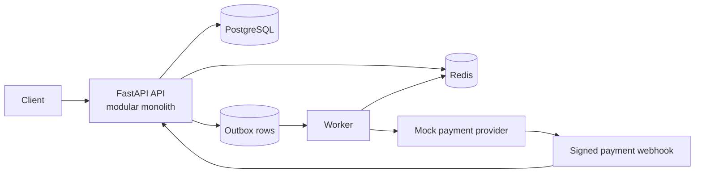

# OrderFlow

OrderFlow is a production-style ordering backend implemented as a Python modular monolith. It models the path from authenticated customer and catalog data through transaction-safe checkout, asynchronous payment processing, and operational observability. A small mock payment provider is intentionally kept outside the application boundary to make external-dependency failure and idempotency concrete.

> This repository is a portfolio project. Claims about test, Docker, or deployment status are recorded in [`docs/verification.md`](docs/verification.md); do not infer production traffic or availability from the design.

## Why this project exists

Order placement is a useful compact example of real backend engineering: money must be exact, inventory must not oversell under concurrent requests, payment calls can be retried or become ambiguous, and database state must remain consistent with asynchronous work. The project favours a comprehensible modular monolith over premature microservices.

## Features

- FastAPI HTTP API with OpenAPI/Swagger documentation.
- JWT authentication, Argon2 password hashing, and customer/admin RBAC.
- Product catalog, inventory, carts, order state machine, and integer minor-unit money.
- PostgreSQL transactions and row-level inventory locking for checkout.
- Checkout idempotency using a required `Idempotency-Key`.
- Mock external payment provider, provider idempotency, signed webhooks, retries, and failure scenarios.
- Transactional outbox for reliable asynchronous intent.
- Redis cache-aside product reads and endpoint rate limiting.
- Background workers for payment/outbox work, structured logs, request IDs, health/readiness, and Prometheus metrics.

## Architecture



The API layer handles transport and dependency injection; module services own transaction-sensitive business rules; SQLAlchemy queries/models and PostgreSQL constraints protect persistence invariants. See [`docs/architecture.md`](docs/architecture.md) and [`docs/database.md`](docs/database.md).

## Checkout in one view

```mermaid
sequenceDiagram
  participant U as Customer
  participant A as API
  participant D as PostgreSQL
  participant Q as Worker/Outbox
  participant P as Payment provider
  U->>A: POST /orders/checkout + Idempotency-Key
  A->>D: transaction; lock inventory rows
  D-->>A: stock reserved; order/payment/outbox committed
  A-->>U: order result
  Q->>P: idempotent charge
  P-->>A: signed webhook
  A->>D: idempotently advance payment/order state
```

## Technology stack

Python 3.12+, FastAPI, Pydantic v2, SQLAlchemy 2.x, PostgreSQL, Alembic, Redis, Celery (or the configured worker), Docker Compose, pytest, Ruff, and GitHub Actions. Exact commands and configured variables should be taken from `pyproject.toml`, `.env.example`, and the verification record.

## Quick start

```bash
cp .env.example .env
docker compose up --build
docker compose exec api python -m app.scripts.seed
```

The API container applies migrations before startup. Open `http://localhost:8000/docs`. The seed command creates these local-development-only accounts:

- Admin: `admin@orderflow.local` / `AdminDemo123!`
- Customer: `customer@orderflow.local` / `CustomerDemo123!`

Never reuse these credentials outside local development.

## API examples

```bash
curl -X POST http://localhost:8000/auth/register \
  -H 'Content-Type: application/json' \
  -d '{"email":"customer@example.test","password":"StrongDemo123!"}'

curl -X POST http://localhost:8000/orders/checkout \
  -H "Authorization: Bearer $TOKEN" \
  -H 'Idempotency-Key: checkout-001'
```

The generated OpenAPI document is the source of truth for payloads. Checkout calculates totals from server-side product snapshots; client totals are never trusted.

## Reliability and concurrency

Two checkouts for the final unit serialize on the PostgreSQL inventory row. One reserves the unit; the other observes insufficient stock and receives a predictable conflict. This guarantee is database-backed and therefore applies across multiple API processes. The integration test requires a real PostgreSQL instance; its status is recorded in [`docs/verification.md`](docs/verification.md). See [`docs/concurrency.md`](docs/concurrency.md), [`docs/payments.md`](docs/payments.md), and [`docs/reliability.md`](docs/reliability.md).

## Running tests and quality checks

Use the commands in the repository's Makefile/CI workflow. Typical checks are:

```bash
ruff check .
pytest
```

Do not treat a command as verified until it is recorded with its result in `docs/verification.md`.

## Deployment

[`docs/deployment.md`](docs/deployment.md) describes a straightforward container deployment without claiming a live environment. [`docs/aws-production.md`](docs/aws-production.md) maps the same boundaries to ECS/Fargate, RDS, ElastiCache, ECR, ALB, Secrets Manager, and CloudWatch.

## Trade-offs and future work

The modular monolith keeps transactions and domain changes easy to reason about; it also means modules share a process and database. The mock provider is deliberately local and not a real payment integration. Future work could add stronger schema versioning, distributed tracing, reconciliation jobs, warehouse/shipping integration, and a load-test suite with measured results.

## Further reading

- [`docs/interview-guide.md`](docs/interview-guide.md) — feature-by-feature study guide and model answers.
- [`docs/security.md`](docs/security.md) — threat model and operational controls.
- [`docs/verification.md`](docs/verification.md) — verified versus environment-limited checks.
