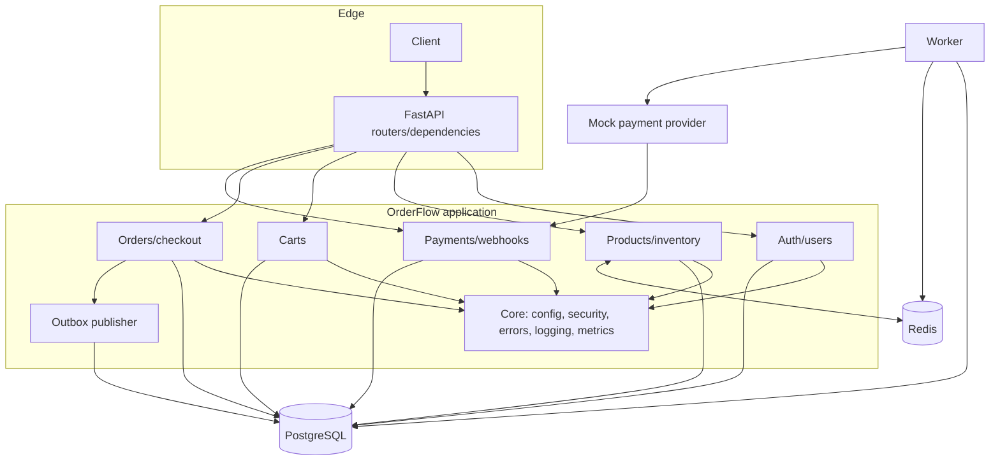

# Architecture

OrderFlow is a modular monolith: one deployable API process with explicit domain modules and a shared PostgreSQL database. The mock payment provider is a separate process because it represents a real external boundary. Background workers are separate processes, but they use the same application modules and database rather than becoming business microservices.

Modules follow the practical flow `router -> service (for transaction-sensitive workflows) -> SQLAlchemy model/query`. Pydantic DTOs mark API boundaries. Routes stay thin for checkout and payment: authentication and validation are dependencies, while transactions and business decisions live in services. Straightforward catalog/cart persistence remains localized in its router module rather than adding a repository abstraction with no reuse.

## Request lifecycle

Request middleware creates or propagates a request ID, the router resolves dependencies, and the relevant module executes parameterized SQLAlchemy statements—through a service for checkout/payment workflows. Errors are converted to stable structured responses. The response is logged with request, order, or payment identifiers where useful.

## Boundary decisions

- PostgreSQL is authoritative for money, orders, inventory, and idempotency records.
- Redis is an optimization and coordination aid, not the source of truth for inventory.
- Outbox rows bridge committed database state to asynchronous work.
- Workers retry retryable provider failures with bounded backoff and idempotent keys.
- The application owns order state transitions centrally; arbitrary status strings are not accepted.

The design intentionally postpones microservices until independent scaling, ownership, or deployment needs justify the operational cost.
