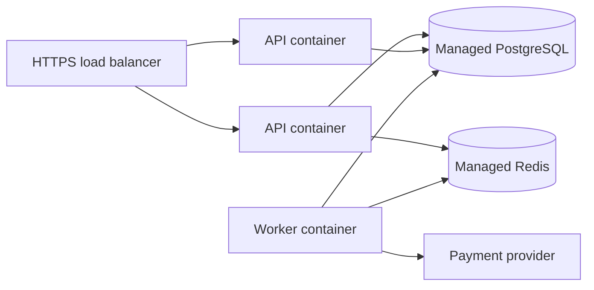

# Deployment

The supported portfolio shape is containerized deployment: build one API image, run the worker separately from the same image/commit, and provide managed PostgreSQL and Redis. The mock provider may run as a second container for demonstrations; a real provider would be configured as an external endpoint.

A release should build an immutable image, run migrations as a controlled one-off job, deploy API and worker processes, verify `/health` and `/ready`, and then shift traffic. Configure `DATABASE_URL`, Redis URL, JWT signing secret, webhook secret, provider URL, and worker settings through the platform secret store. Use persistent managed databases and backups; do not treat Docker Compose volumes as production durability.

This document is a deployment plan, not evidence of a live deployment. See `docs/verification.md` for commands actually run in the current environment.
