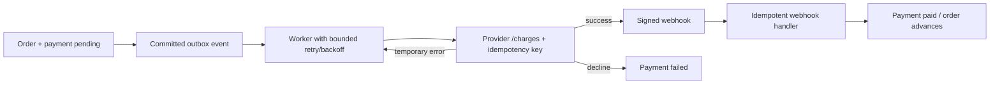

# Payments and webhooks

Checkout creates a payment intent in the same PostgreSQL transaction as the order and outbox event. A worker later calls the mock provider with a stable provider idempotency key derived from the logical payment. The provider returns success, decline, or retryable failure scenarios for deterministic tests.

The provider key makes a retry after a timeout safe: a repeated logical charge returns the existing provider result rather than creating another charge. The webhook is authenticated with HMAC/shared-secret verification and deduplicated by provider event ID. State changes are guarded by the payment/order state machine, so duplicate delivery cannot advance an order twice.

An ambiguous case remains explicit: the worker may crash after the provider charged but before local acknowledgement. Retrying with the same idempotency key is the recovery path; a reconciliation job can later compare provider state with local state. Real payment systems require provider-specific signing, dispute, refund, and reconciliation controls beyond this mock.
